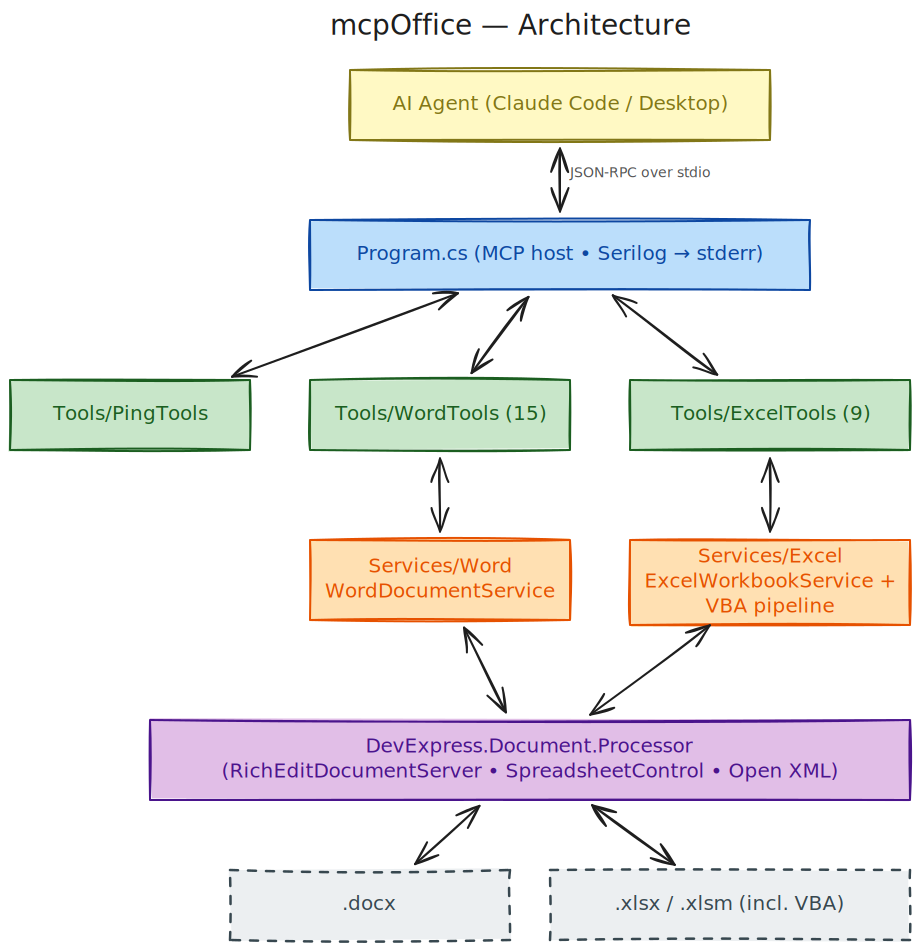

# mcpOffice

An MCP (Model Context Protocol) server for Microsoft Office documents, written in C# (.NET 9) and backed by DevExpress Office File API packages. It lets AI agents read, write, and convert Office documents through tool calls instead of one-off scripts.

**Status:** Word (.docx) and Excel (.xlsx / .xlsm) POCs are complete, including `excel_analyze_vba` v1 (procedures, event handlers, call graph, object-model references, file/DB/network/automation/shell dependencies). Next: `excel_analyze_vba` v2 — conversion hints toward Excel-to-C# migration tooling.

## Architecture



Source: [`docs/img/architecture.excalidraw`](docs/img/architecture.excalidraw) (open in [Excalidraw](https://excalidraw.com)). See [ARCHITECTURE.md](ARCHITECTURE.md) for the full layer map.

## Documents

- [Architecture](ARCHITECTURE.md) — layer map, domains, tool-adding pattern, error model, VBA pipeline diagram.
- [Usage](docs/usage.md) — build, run, MCP client config, sample calls, troubleshooting.
- [Word design](docs/plans/2026-04-30-mcpoffice-word-poc-design.md) — Word tool surface, error model.
- [Word implementation plan](docs/plans/2026-04-30-mcpoffice-word-poc-plan.md) — task-by-task TDD plan.
- [Excel design](docs/plans/2026-05-01-mcpoffice-excel-poc-design.md) — Excel tool surface and rationale.
- [VBA extraction plan](docs/plans/2026-05-01-mcpoffice-excel-vba-extraction-plan.md) — MS-OVBA decompression, OpenMcdf walking.

## Current Tools

24 tools shipped: 1 ping + 15 Word + 8 Excel.

### Word

- `word_get_outline(path)`
- `word_get_metadata(path)`
- `word_read_markdown(path)`
- `word_read_structured(path)`
- `word_list_comments(path)`
- `word_list_revisions(path)`
- `word_create_blank(path, overwrite=false)`
- `word_create_from_markdown(path, markdown, overwrite=false)`
- `word_append_markdown(path, markdown)`
- `word_find_replace(path, find, replace, useRegex=false, matchCase=false)`
- `word_insert_paragraph(path, atIndex, text, style?)`
- `word_insert_table(path, atIndex, headers[], rows[][])`
- `word_set_metadata(path, properties)`
- `word_mail_merge(templatePath, outputPath, dataJson)`
- `word_convert(inputPath, outputPath, format?)`

### Excel

- `excel_list_sheets(path)` — sheets in order with visibility, used range, dimensions.
- `excel_read_sheet(path, sheetName?, sheetIndex?, range?, includeFormulas=true, includeFormats=false, maxCells=50000)` — cell data with formulas + formats.
- `excel_get_metadata(path)` — author, title, created/modified, sheet count, document properties.
- `excel_list_defined_names(path)` — workbook + sheet-scoped names with refersTo / scope / hidden flag.
- `excel_list_formulas(path, sheetName?, includeValues=false, maxFormulas=10000)` — formula cells with optional cached values.
- `excel_get_structure(path, includeSheets=true, includeFormulas=true, includeDefinedNames=true)` — workbook rollup sized for huge workbooks.
- `excel_extract_vba(path)` — static VBA module source via in-process MS-OVBA decompression (no Excel install required).
- `excel_analyze_vba(path, includeProcedures=true, includeCallGraph=false, includeReferences=false, moduleName?)` — structural analysis on top of the extracted source: procedures with signatures, event handlers, call graph (with intra-workbook resolution), Excel object-model references, and external dependencies (file/DB/network/automation/shell). Pass `moduleName` to scope the heavy arrays to a single module on large workbooks; the summary stays whole-workbook.

### Other

- `Ping` — health check, returns `pong`.

All file paths passed to tools must be absolute.

## Example

Create a Word document from Markdown, then convert it to PDF:

```json
{
  "path": "C:\\Temp\\proposal.docx",
  "markdown": "# Proposal\n\nHello **Word**.",
  "overwrite": false
}
```

```json
{
  "inputPath": "C:\\Temp\\proposal.docx",
  "outputPath": "C:\\Temp\\proposal.pdf"
}
```

Extract VBA modules from a macro-enabled workbook:

```json
{
  "path": "C:\\Workbooks\\AnalysisTool.xlsm"
}
```

## Roadmap

1. **Word POC** — read / write / convert .docx ✓
2. **Excel POC** — read sheets, list formulas/structure/defined names, extract VBA ✓
3. **`excel_analyze_vba` v1** — call graph, event handlers, Excel object-model refs, external dependencies ✓
4. **`excel_analyze_vba` v2** — conversion hints (procedure role classification, suggested C# equivalents, DOT/Mermaid call-graph rendering, cross-module coupling score).
5. PowerPoint (.pptx).
6. PDF.

## Built With

- [`ModelContextProtocol`](https://github.com/modelcontextprotocol/csharp-sdk) — C# MCP SDK.
- DevExpress RichEdit / Spreadsheet / Office File API packages — server-side document APIs.
- [`MarkdownToDocxGenerator`](https://www.nuget.org/packages/MarkdownToDocxGenerator) — richer Markdown-to-DOCX import.
- [`OpenMcdf`](https://www.nuget.org/packages/OpenMcdf) — OLE compound file reader for VBA project extraction.
